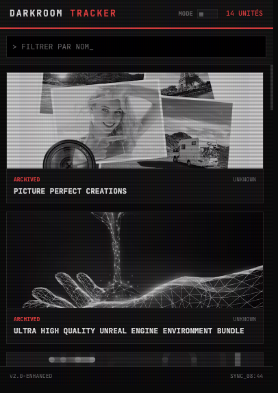
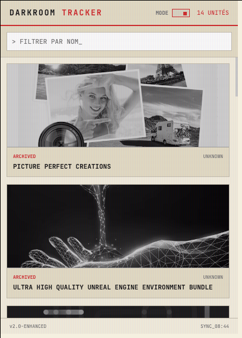

# 📸 Darkroom Bundle Tracker (Chrome Extension)

> "Ne ratez plus jamais un bundle. Surveillance active avec esthétique Darkroom."

## 🌑 Aperçu

Cette extension accompagne le projet [Humble Software Tracker](https://bloodeyesx.github.io/). Elle permet de surveiller les offres logicielles en temps réel directement depuis votre navigateur.

| **Tactical Night (Dark Mode)** | **Office Paper (Light Mode)** |
|:---:|:---:|
|  |  |
| *Pour les environnements à faible luminosité.* | *Pour une lisibilité maximale en journée.* |

## ✨ Fonctionnalités Clés

* **🕵️ Surveillance Active :** Scan automatique en arrière-plan toutes les 30 minutes.
* **🔴 Notifications :** Badge rouge sur l'icône dès qu'une offre est détectée.
* **⚡ Détection "FRESH" :** Les bundles de moins de 24h pulsent en rouge.
* **🎨 Dual Theme Engine :** Basculez instantanément entre le mode Sombre et Clair.
* **🔍 Recherche Live :** Filtrez les bundles par nom instantanément.

## 🔧 Installation

Cette extension n'est pas sur le Chrome Web Store (pour l'instant). Voici comment l'installer manuellement :

1.  **Téléchargez** le code (Bouton vert `<> Code` > `Download ZIP`) et décompressez-le.
2.  Ouvrez Chrome et allez sur l'adresse `chrome://extensions`.
3.  Activez le **Mode développeur** (en haut à droite).
4.  Cliquez sur **Charger l'extension non empaquetée**.
5.  Sélectionnez le dossier décompressé.

## 🛠️ Stack Technique

* **Core :** Manifest V3 & Service Workers
* **UI :** HTML5 / CSS3 (Grid & Flexbox)
* **Logic :** Vanilla JavaScript (Pas de frameworks)
* **Source de données :** Flux XML généré par [Bloodeyesx.github.io](https://github.com/Bloodeyesx/Bloodeyesx.github.io)

---

  <i>Développé par Bloodeyesx • Licence MIT</i>

